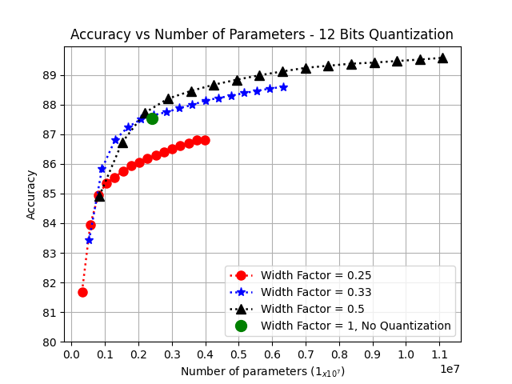

## Decentralized Low-Latency Collaborative Inference on the Edge

Performing Edge Ensembles via Bagging & Random Noise Initializations:

1. The *Config_files* folder comprised of all the setting for running the code:
  
   - To select number of participating users, go to Ensemble/ensemble_params.yaml, change the value in:
   
     n_ensemble: num_of_users
     
   - To select number of quantization bits, go to Quantization/quantization_params.yaml, change the value in: 
   
     n_embed: num_of_vectors
     
     n_parts: num_of_parts (which we split each vector)

   - To define all other hyperparameters, go to Training/training_params.yaml, change the value in: 
   
     lr: learning_rate
   
     batch_size: size_of_batch
     
     
2. The *Archs* folder comprised of all the setting for running the code:

   - In the folder can be found two different architectures: MobileNetV2 and ResNet18.
   
   - Each one can be selected in the main.py file via the imports section.

3. The datasets selected are CIFAR10 / CIFAR100 and Imagewoof. 

CIFAR10 / CIFAR100 imported by *torchvision.models*. 

Imagewoof is imported seperatly and used locally.

It is very simple to use user dataset. Few thing that are necessary is to update the output layer with the number of classes. This can be done in the architecture selection in the *Arch* folder and change the transformation applied to the data (which are currently suitable for CIFAR).
